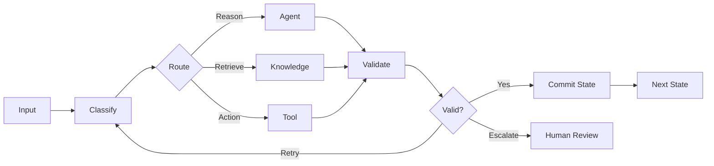
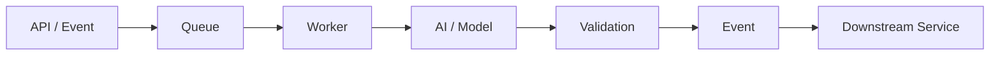

<div align="center">

# Mohammad Ariz Aftab

### Senior AI Engineer · Agentic Systems · LLM Inference · MLOps · HPC

<br/>

<a href="https://git.io/typing-svg">
  
</a>

<br/>

[](https://github.com/ariz565)


</div>

---

## About Me

> **“I like building systems where software, infrastructure and AI come together.”**

I'm a **Senior AI Engineer with 3+ years of engineering experience**, working across LLM systems, agentic AI, model inference, fine-tuning, MLOps, HPC and distributed backend systems.

My work has increasingly moved toward the parts of AI systems that become difficult once you move beyond a prototype:

- **Agentic AI and long-horizon execution**
- **LLM inference and serving**
- **Fine-tuning and model adaptation**
- **MLOps / LLMOps**
- **AI evaluation and observability**
- **Event-driven AI backends**
- **Distributed GPU and HPC workloads**
- **AI governance and responsible AI**
- **Healthcare AI and FinTech AI**
- **PHI / PII-aware AI workflows**
- **AWS and Azure AI infrastructure**

I enjoy working close to the boundary between **models, distributed systems and infrastructure** — where model behavior, latency, GPU utilization, state, data privacy, failure recovery and system design all start affecting each other.

---

# What I Work On

## Agentic AI Systems

A large part of my current interest is in agents that do more than execute a single prompt → response cycle.

I work with patterns around:

- Long-horizon agent execution
- Tool calling and tool orchestration
- Agent harness design
- State machines
- Graph-based workflows
- Conditional routing
- Planning and execution loops
- Supervisor / worker architectures
- Multi-agent coordination
- Human-in-the-loop approvals
- Checkpointing and resumability
- Retry and recovery strategies
- Agent state persistence
- Context management
- Structured outputs
- Tool permission boundaries

The hard part usually isn't giving an agent access to tools.

It's deciding:

> **what the agent is allowed to do, what state it should remember, when it should stop, and how the system recovers when something fails halfway through.**

---

## Long-Horizon Agents

Long-running agents introduce a different set of engineering problems than normal LLM applications.

I think about things like:

```text
Goal
  ↓
Planner
  ↓
State
  ↓
Action
  ↓
Tool Execution
  ↓
Observation
  ↓
State Transition
  ↓
Evaluation
  ↓
Continue / Retry / Escalate / Stop
```

Key areas include:

- Durable execution
- State transitions
- Intermediate checkpoints
- Idempotent tool execution
- Failure recovery
- Context compression
- Memory boundaries
- Loop termination
- Task decomposition
- Execution budgets
- Human escalation
- Audit trails

This is where agent engineering starts looking a lot like **distributed systems engineering**.

---

## Graph & State-Machine Engineering

I prefer explicit control flow for complex agents rather than hiding everything inside one autonomous loop.

I work with concepts such as:



This gives the system clearer control over:

- branching
- retries
- loops
- tool execution
- approvals
- terminal states
- failure states
- state persistence

I like keeping the **reasoning probabilistic and the control plane explicit**.

---

# LLM Inference Engineering

Inference is one of the AI engineering areas I find particularly interesting.

Once models are serving real workloads, the conversation becomes less about simply “hosting an LLM” and more about:

- **TTFT — Time to First Token**
- **TPOT — Time per Output Token**
- End-to-end latency
- Throughput
- GPU utilization
- Memory pressure
- Batch efficiency
- Context length
- Cost per request
- Request scheduling

Areas I work with and study include:

- vLLM
- TensorRT-LLM
- Triton Inference Server
- Continuous batching
- Paged KV cache
- Prefix caching
- KV-cache reuse
- Chunked prefill
- Prefill / decode separation
- Speculative decoding
- Quantization
- Tensor parallelism
- Pipeline parallelism
- Expert parallelism
- Context parallelism
- Distributed inference
- Multi-GPU serving
- Autoscaling inference workloads
- GPU memory utilization

For me, inference engineering is essentially:

> **How much useful model work can we get from the available compute without destroying latency or cost?**

---

# Fine-Tuning & Model Adaptation

Not every problem needs a larger model.

Sometimes the better answer is improving how a smaller or specialized model behaves for a particular task.

My interests around model adaptation include:

- Supervised Fine-Tuning (**SFT**)
- LoRA
- QLoRA
- PEFT
- Instruction tuning
- Domain adaptation
- Dataset preparation
- Training-data quality
- Synthetic data generation
- Evaluation dataset design
- Model comparison
- Hyperparameter experimentation
- Fine-tuning pipelines
- Checkpoint management
- Experiment tracking

I think the important question isn't:

> “Can we fine-tune this model?”

It is:

> **“Will fine-tuning materially improve this task compared with prompting, retrieval, tools or better system design?”**

---

# RAG & Knowledge Systems

I work with retrieval systems as an engineering problem rather than treating RAG as just:

```text
embed → retrieve → prompt
```

The full system involves:

- Document ingestion
- Parsing
- Chunking strategies
- Metadata design
- Embeddings
- Vector search
- Hybrid retrieval
- Semantic retrieval
- Metadata filtering
- Reranking
- Context assembly
- Query rewriting
- Context compression
- Citation / provenance tracking
- Grounded generation
- Retrieval evaluation

And most importantly:

**measuring whether retrieval actually helped the final task.**

---

# AI Evaluation

Evals are becoming one of the most important pieces of my AI engineering work.

I care about measuring systems at multiple levels.

### Model

- Output quality
- Structured-output correctness
- Instruction following
- Domain-specific accuracy

### Retrieval

- Recall
- Precision
- Ranking quality
- Context relevance
- Groundedness

### Agents

- Task completion
- Tool selection
- Tool-call correctness
- State transitions
- Number of steps
- Recovery behavior
- Loop behavior

### System

- Latency
- Throughput
- Token consumption
- GPU utilization
- Cost
- Failure rate

I prefer evaluations tied to **actual task outcomes** rather than relying only on generic benchmarks.

---

# MLOps / LLMOps

Model behavior is only one part of an AI system.

I also work around the lifecycle surrounding it:

```text
Data
 ↓
Training / Adaptation
 ↓
Evaluation
 ↓
Model Registry
 ↓
Deployment
 ↓
Inference
 ↓
Tracing
 ↓
Monitoring
 ↓
Feedback
 ↓
Evaluation
 ↓
Iteration
```

Areas include:

- Model versioning
- Dataset versioning
- Experiment tracking
- Fine-tuning pipelines
- Model registry
- CI/CD for AI workloads
- Evaluation pipelines
- Prompt versioning
- Model routing
- Inference monitoring
- Cost monitoring
- Drift / regression detection
- Rollbacks
- A/B testing
- Observability
- Trace analysis

---

# Event-Driven AI Systems

A lot of AI workflows should not run inside a synchronous request.

I work with architectures where AI tasks move through asynchronous pipelines:



Examples include:

- Document processing
- Batch inference
- Agent execution
- Long-running workflows
- Evaluation jobs
- Model pipelines
- Notification workflows
- Human approval steps
- GPU workloads

Typical concerns include:

- queues
- workers
- retries
- dead-letter queues
- idempotency
- backpressure
- event schemas
- distributed state
- observability
- failure recovery

---

# High-Performance Computing

I've worked on **cloud-based HPC infrastructure** where compute environments can be provisioned and managed programmatically.

My work has involved:

- On-demand cluster provisioning
- Cluster lifecycle management
- Job orchestration
- Compute environment management
- Multi-tenant environments
- Job monitoring
- Resource allocation
- Infrastructure automation
- Distributed compute workloads
- AWS-based HPC systems

HPC has also influenced how I think about AI infrastructure.

Modern AI systems increasingly deal with the same underlying questions:

```text
Compute
Memory
Networking
Scheduling
Parallelism
Utilization
Faults
Cost
```

---

# Healthcare AI

I've worked in **Healthcare AI**, where the engineering constraints are very different from building a general consumer AI application.

The system has to account for sensitive data and clearly defined access boundaries.

Areas I work around include:

- PHI handling
- PII detection
- Data redaction
- Data minimization
- Role-based access
- Audit logging
- Secure model access
- Controlled tool execution
- Data lineage
- Model traceability
- Human review
- Governance controls

Healthcare AI taught me that model capability alone is rarely enough.

**Data boundaries and system controls matter just as much.**

---

# FinTech AI

I've also worked with AI systems in the **financial domain**, where traceability and control become first-class engineering concerns.

I focus on concepts such as:

- PII protection
- Auditability
- Explainable execution paths
- Model validation
- Human approval boundaries
- Policy enforcement
- Data lineage
- Access controls
- Deterministic validation
- Model monitoring
- Risk-aware workflows

For regulated domains, I prefer designing systems where you can answer:

```text
What happened?
Why did it happen?
Which model was involved?
Which data was used?
Which tool was called?
Who approved it?
What changed?
Can we reproduce it?
```

---

# AI Governance & Responsible AI

Agentic systems create a much larger action surface than standard chat applications.

I care about building controls around:

- Tool permissions
- Least-privilege execution
- Prompt-injection defenses
- Data classification
- PII / PHI boundaries
- Input validation
- Output validation
- Model access policies
- Human approvals
- Audit trails
- Model provenance
- Dataset provenance
- Policy enforcement
- Agent action logging
- Responsible AI controls

I prefer treating governance as something implemented **inside the architecture**, not something added as documentation after the system is built.

---

# Cloud AI Infrastructure

## AWS

<p>
  
</p>

Working across:

`EC2` · `ECS` · `ECR` · `Lambda` · `S3` · `DynamoDB` · `IAM` · `CloudFormation` · `Bedrock`

Areas:

`AI Infrastructure` · `HPC` · `Distributed Compute` · `Serverless` · `Event-Driven Systems` · `Model Integration`

---

## Azure

<p>
  
</p>

Working across Azure for:

- AI services
- Cloud infrastructure
- Model deployment
- Compute
- Storage
- Identity
- Event-driven systems
- AI workload integration

---

# AI Engineering Stack

## Models & Agentic AI

`LLMs`  
`Agentic AI`  
`RAG`  
`Tool Calling`  
`Long-Horizon Agents`  
`State Machines`  
`Graph Workflows`  
`Structured Outputs`  
`Human-in-the-Loop`

---

## Model Adaptation

`Fine-Tuning`  
`SFT`  
`LoRA`  
`QLoRA`  
`PEFT`  
`Domain Adaptation`  
`Synthetic Data`

---

## Inference

`vLLM`  
`TensorRT-LLM`  
`Triton`  
`Continuous Batching`  
`KV Cache`  
`Prefix Caching`  
`Speculative Decoding`  
`Quantization`  
`Distributed Inference`

---

## AI Platform

`MLOps`  
`LLMOps`  
`Model Serving`  
`Evaluation`  
`Tracing`  
`Observability`  
`Model Versioning`  
`Experiment Tracking`

---

## Infrastructure

`AWS`  
`Azure`  
`Docker`  
`HPC`  
`Distributed Systems`  
`Event-Driven Architecture`  
`GPU Compute`

---

## Languages

<p>
  
</p>

`Python` · `Java`

---

# How I Think About AI Systems

```text
                         ┌─────────────┐
                         │   Product   │
                         │   Problem   │
                         └──────┬──────┘
                                │
                                ▼
                      ┌──────────────────┐
                      │ Data + Context   │
                      └────────┬─────────┘
                               │
              ┌────────────────┼─────────────────┐
              ▼                ▼                 ▼
        ┌──────────┐     ┌──────────┐      ┌──────────┐
        │ Retrieval│     │  Model   │      │  Tools   │
        └─────┬────┘     └────┬─────┘      └────┬─────┘
              │               │                 │
              └───────────────┼─────────────────┘
                              ▼
                       ┌─────────────┐
                       │ Agent /     │
                       │ State Graph │
                       └──────┬──────┘
                              │
                  ┌───────────┼────────────┐
                  ▼           ▼            ▼
               Evals      Governance    Events
                  │           │            │
                  └───────────┼────────────┘
                              ▼
                       ┌─────────────┐
                       │ Inference & │
                       │ Infrastructure
                       └─────────────┘
```

The model is important.

But the model is only one component.

---

# Engineering Principles

```python
ai_engineering = {
    "agents": "Give autonomy clear boundaries.",
    "state": "Make important state explicit and recoverable.",
    "inference": "Optimize latency, throughput and cost together.",
    "evals": "Measure the task, not just the model.",
    "fine_tuning": "Adapt the model only when adaptation is the right tool.",
    "rag": "Retrieval quality matters more than retrieval complexity.",
    "privacy": "Sensitive data should have explicit boundaries.",
    "governance": "Controls belong in the architecture.",
    "distributed_systems": "Assume partial failures will happen.",
    "cloud": "Compute should be observable, reproducible and measurable."
}
```

---

# Areas I'm Deepening

```text
01. Agentic AI Systems
02. Long-Horizon Agent Execution
03. LLM Inference Engineering
04. Fine-Tuning & Model Adaptation
05. MLOps / LLMOps
06. AI Evaluation
07. Distributed GPU Inference
08. HPC for AI
09. Event-Driven AI Systems
10. Responsible AI & Governance
11. Healthcare AI
12. FinTech AI
13. AI Security
14. AWS AI Infrastructure
15. Azure AI Infrastructure
```

---

# Currently

```yaml
working_on:
  - agentic AI systems
  - long-horizon workflows
  - LLM inference
  - event-driven AI backends
  - healthcare AI
  - fintech AI
  - cloud AI infrastructure

deepening:
  - fine-tuning
  - inference optimization
  - evaluation engineering
  - distributed inference
  - agent state management
  - AI governance

thinking_about:
  - TTFT and throughput
  - GPU utilization
  - KV-cache efficiency
  - context engineering
  - long-running agent state
  - model and tool boundaries
  - PHI / PII
  - eval coverage
  - cost per successful task
```

---

## GitHub Activity

<div align="center">


<br/><br/>


</div>

---

<div align="center">

### Building AI systems from model behavior to distributed execution.

<br/>

**Agentic AI · Inference · Fine-Tuning · MLOps · HPC · Distributed Systems**

<br/>

**Healthcare AI · FinTech AI · AWS · Azure**

<br/><br/>

[](https://github.com/ariz565)

</div>
