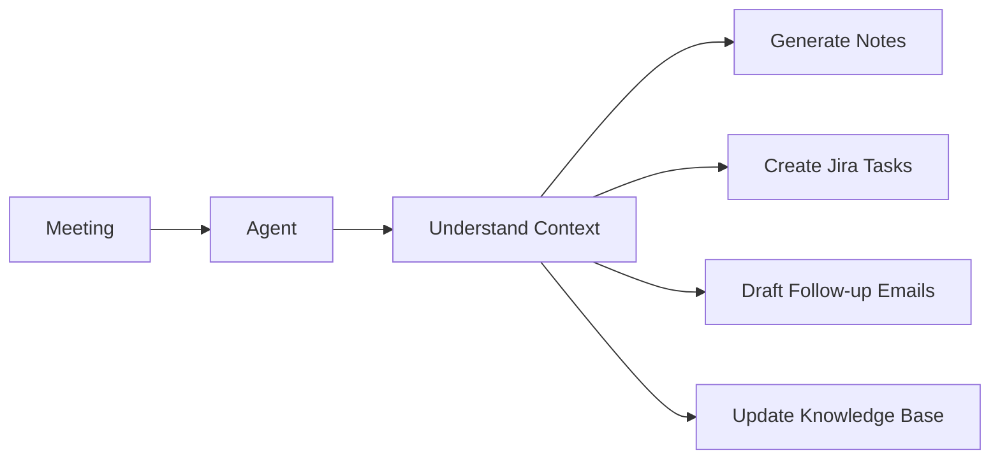

<div align="center">

# Mohammad Ariz Aftab

### AI Engineer · Distributed Systems · LLMs · Agentic AI · HPC · Cloud

<br/>

<a href="https://git.io/typing-svg">
  
</a>

<br/>

[](https://github.com/ariz565)


</div>

---

## About Me

> **“I like building systems where software, infrastructure and AI come together.”**

I'm an **AI Engineer with 3+ years of experience** working across backend engineering, cloud infrastructure, HPC and LLM-based applications.

Most of my work has involved taking an idea, understanding how the pieces should fit together, and building the backend and infrastructure around it.

I've worked on systems for:

- Cloud-based HPC cluster provisioning
- LLM and RAG workflows
- Document extraction and validation
- Event-driven backend services
- AWS automation
- Cost monitoring across AWS accounts
- Full-stack and e-commerce platforms

I enjoy problems where there is more going on than just writing an API or calling a model.

The interesting part for me is usually figuring out how the **backend, infrastructure, data, AI and user workflow** should work together.

---

## What I Work On

### AI & LLM Systems

A lot of my recent work has been around LLM-based applications and automation.

I've worked on:

- Retrieval-Augmented Generation (**RAG**)
- Document data extraction
- Field validation
- Summarization workflows
- Prompt and context handling
- AWS Bedrock integrations
- AI-powered backend APIs
- Agent-style workflows
- Human approval steps inside automated processes

I usually think of the model as one part of the system.

The bigger challenge is deciding what happens **before the model, after the model, and when the model gets something wrong**.

---

### Backend & Distributed Systems

Backend engineering has been a major part of my work.

I've built and worked with:

- Event-driven architectures
- REST APIs
- Async workflows
- Background jobs
- Multi-service applications
- Authentication and authorization
- Multi-tenant systems
- Cloud resource orchestration
- Compute lifecycle management

I enjoy designing systems where responsibilities are clear and each service has a reason to exist.

---

### High-Performance Computing

One of the more interesting areas I've worked in is **cloud HPC**.

I helped build a multi-tenant system that can provision and manage HPC environments on AWS.

The work included:

- Creating HPC clusters on demand
- Managing cluster lifecycle
- Orchestrating compute environments
- Tracking running jobs
- Supporting multiple users and environments
- Automating infrastructure creation and cleanup

A lot of the challenge was making complicated cloud infrastructure easier to manage from the application layer.

---

## Selected Work

<table>
<tr>
<td width="50%" valign="top">

### Cloud HPC Platform

Worked on a **multi-tenant HPC platform on AWS** that could create and manage compute clusters when needed.

**What I worked on**

- Cluster provisioning
- Compute environment orchestration
- Cluster lifecycle handling
- Job monitoring
- Multi-tenant architecture
- AWS service integrations

**Tech / Areas**

`AWS` `HPC` `Distributed Systems` `Backend`

</td>

<td width="50%" valign="top">

### LLM Document Processing

Designed a backend workflow using **RAG and LLMs** to process structured and unstructured documents.

**What it handled**

- Data extraction
- Field validation
- Context retrieval
- Summarization
- API workflows
- LLM orchestration

**Tech / Areas**

`Python` `LLMs` `RAG` `AWS Bedrock`

</td>
</tr>

<tr>
<td width="50%" valign="top">

### AWS Cost Monitoring

Built a cross-account AWS cost monitoring system to bring billing information from different accounts into one place.

**What it included**

- Cost aggregation
- Budget tracking
- Tag-based reporting
- Cross-account access
- Reporting workflows
- Cost visibility

**Tech / Areas**

`AWS` `Cloud` `Automation` `FinOps`

</td>

<td width="50%" valign="top">

### E-commerce Platform

Built a performance-focused e-commerce application using **Next.js** with caching, recommendations and payment integrations.

**What it included**

- Next.js SSR / SSG
- Redis caching
- Product recommendation logic
- Razorpay payments
- Cloudinary integration
- Order workflows
- SEO improvements

**Tech / Areas**

`Next.js` `Redis` `Razorpay` `Cloudinary`

</td>
</tr>
</table>

---

## What I'm Exploring Now

I'm currently interested in building agents that can take part in day-to-day work instead of only answering questions.

One idea I'm exploring is a meeting assistant that can:



The part I find interesting is not just generating the notes.

It's figuring out:

- What should happen automatically?
- What should require approval?
- How should context be carried between steps?
- What happens if one tool call fails?
- How do you stop the agent from doing too much?
- How do you keep a clear history of what it changed?

Those are the kinds of problems I'm spending more time on.

---

# Tech Stack

## AI / LLM

<p>
  
  
  
  
</p>

`LLMs` · `RAG` · `Agentic Workflows` · `Document Processing` · `AWS Bedrock`

---

## Languages

<p>
  
</p>

`Python` · `Java` · `JavaScript` · `TypeScript`

---

## Backend

<p>
  
</p>

`Flask` · `Django` · `Node.js` · `Express.js` · `Spring Boot` · `REST APIs`

---

## Frontend

<p>
  
</p>

`React` · `Next.js` · `Tailwind CSS`

---

## Cloud & Infrastructure

<p>
  
</p>

**AWS**

`EC2` · `Lambda` · `DynamoDB` · `S3` · `Bedrock` · `ECS` · `ECR` · `CloudFormation` · `IAM`

**Other**

`Docker` · `HPC` · `Cloud Automation` · `Multi-account AWS`

---

## Databases & Caching

<p>
  
</p>

`PostgreSQL` · `MySQL` · `MongoDB` · `Firebase` · `Redis`

---

## Tools

<p>
  
</p>

`Git` · `GitHub` · `GitHub Actions` · `Postman` · `Jira` · `VS Code`

---

## How I Approach Engineering

I usually think about a system in this order:

```text
Problem
   ↓
Users / Workflow
   ↓
Architecture
   ↓
Data
   ↓
Backend
   ↓
AI / LLM
   ↓
Infrastructure
   ↓
Monitoring
   ↓
Iteration
```

For AI projects especially, I try not to start with:

> “Which model should we use?”

I prefer starting with:

> “What problem are we actually trying to solve, and where does AI genuinely help?”

That usually leads to better systems.

---

## A Few Things I've Learned

```python
engineering_notes = {
    "architecture": "Simple systems are easier to understand and easier to change.",
    "ai": "LLMs are useful, but they should not be trusted with everything.",
    "cloud": "Automate infrastructure when the same manual step happens twice.",
    "performance": "Measure first. Optimize second.",
    "security": "Give every service only the access it actually needs.",
    "backend": "Clear boundaries save a lot of pain later.",
    "automation": "Automate repetitive work, not human judgment."
}
```

---

## Areas I'm Interested In

```text
01. LLM Applications
02. RAG
03. AI Agents
04. Distributed Systems
05. Event-Driven Architecture
06. High-Performance Computing
07. AWS
08. Backend Engineering
09. Infrastructure Automation
10. AI Evaluation
```

---

## GitHub Stats

<div align="center">


<br/><br/>


<br/>


</div>

---

## Currently

```yaml
working_on:
  - AI and LLM backend systems
  - distributed applications
  - cloud HPC platforms
  - workflow automation

exploring:
  - meeting agents
  - tool-using AI agents
  - context management
  - LLM evaluation
  - event-driven AI workflows

learning_more_about:
  - system design
  - AI reliability
  - cloud cost
  - observability
  - distributed systems
```

---

<div align="center">

### I enjoy building things, understanding how they work, and making them better.

<br/>

**AI · Backend · HPC · Distributed Systems · AWS**

<br/>

[](https://github.com/ariz565)

<br/><br/>

<sub>
Currently building at the intersection of AI, backend systems and cloud infrastructure.
</sub>

</div>
